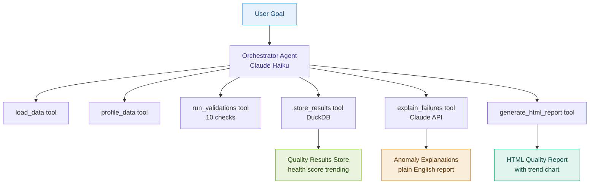
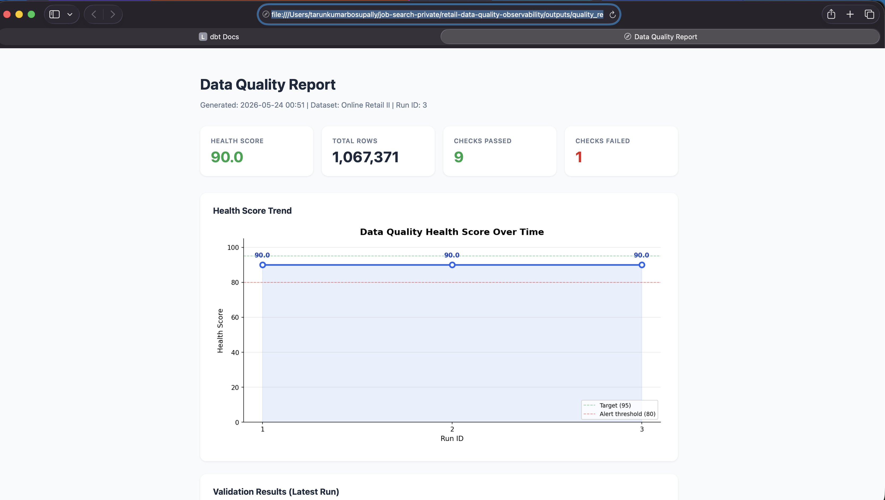
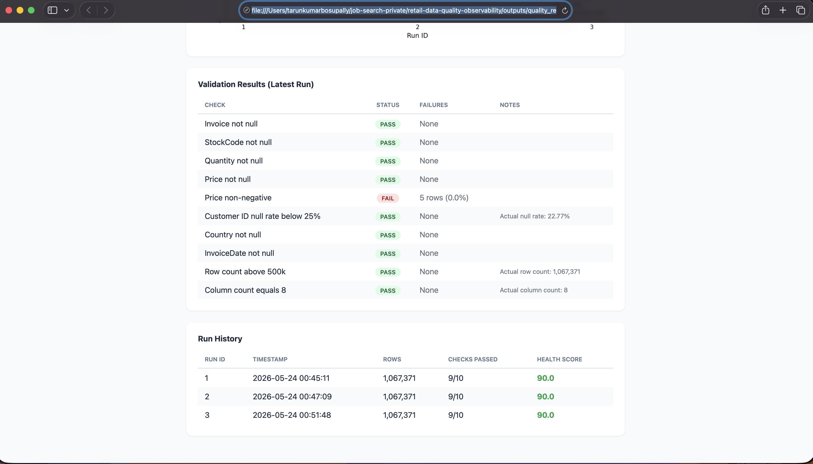

# Retail Data Quality and Observability Pipeline

> Most data teams find out their data is broken when a dashboard is wrong. This pipeline finds it first.

## Problem

Data quality failures are silent. They propagate through pipelines, corrupt dashboards, and reach stakeholders before anyone notices. Traditional validation runs once and produces a report nobody reads. There is no trend tracking, no plain-English explanation of what broke, and no observable health score over time.

## Solution

An agent-orchestrated observability pipeline where Claude autonomously profiles, validates, explains anomalies in plain English, and tracks data health scores over time. The agent decides its own tool sequence. No manual orchestration required.

## Architecture



## Features

- 9-tool agentic pipeline orchestrated by Claude Haiku with no manual sequencing
- 10 validation checks covering nulls, value ranges, schema structure, and row counts
- LLM-powered anomaly explainer converting raw failures into plain-English stakeholder reports
- DuckDB results store tracking health scores across every run for trend analysis
- HTML quality report and PNG trend chart generated automatically on each run
- One command runs the entire pipeline end to end

## Screenshots

### Health Score Trend


### Validation Results and Run History


## Validation Suite

| Check | Type | Threshold |
|---|---|---|
| Invoice not null | Completeness | 0 nulls |
| StockCode not null | Completeness | 0 nulls |
| Quantity not null | Completeness | 0 nulls |
| Price not null | Completeness | 0 nulls |
| Price non-negative | Validity | 0 negative values |
| Customer ID null rate below 25% | Threshold | Max 25% nulls |
| Country not null | Completeness | 0 nulls |
| InvoiceDate not null | Completeness | 0 nulls |
| Row count above 500k | Volume | Min 500,000 rows |
| Column count equals 8 | Schema | Exactly 8 columns |

## Results

| Metric | Value |
|---|---|
| Dataset size | 1,067,371 rows |
| Health score | 90/100 (stable across 3 runs) |
| Checks passed | 9/10 |
| Failed check | Price non-negative (5 rows, 0.0005%) |
| Customer ID null rate | 22.77% (within threshold, flagged as guest purchases) |
| LLM explanation cost | Under $0.50 total across all runs |

## KPIs

| KPI | Definition | Why It Matters |
|---|---|---|
| Health Score | % of checks passed per run | Single trackable number for stakeholders |
| Null Rate by Column | % of nulls per field | Catches upstream pipeline breaks |
| Failure Count | Rows failing any check | Measures unusable data volume |
| Health Score Trend | Score across multiple runs | Shows if quality is improving or degrading |

## Tech Stack

| Tool | Purpose |
|---|---|
| Python | Core pipeline scripting |
| Claude API (Haiku) | Agent orchestration and anomaly explanation |
| DuckDB | Results storage and run history |
| Great Expectations | Validation framework |
| pandas | Data profiling |
| matplotlib | Trend chart generation |

## How to Run

```bash
git clone https://github.com/Tarun-B-12/retail-data-quality-observability.git
cd retail-data-quality-observability
python -m venv venv
source venv/bin/activate
pip install -r requirements.txt
cp .env.example .env
# Add ANTHROPIC_API_KEY to .env
# Download online_retail_II.csv from Kaggle and place in data/raw/
python agent/orchestrator.py
```

## Output Artifacts

| Artifact | Description |
|---|---|
| `outputs/quality_results.duckdb` | Run history database with health scores |
| `outputs/anomaly_explanations.md` | LLM-generated plain-English failure explanations |
| `outputs/trend_chart.png` | Health score trend visualization |
| `outputs/quality_report.html` | Full HTML quality report with score cards |

## Limitations

- Dataset is static. Production version would connect to a live warehouse.
- Validation rules are hand-coded. Production version would support dynamic rule configuration.
- Single dataset. Architecture supports any tabular dataset with minimal changes.

## Future Improvements

- GitHub Actions to schedule pipeline runs automatically
- Slack or email alerts when health score drops below threshold
- Column-level trend tracking beyond overall score
- Connect to Snowflake, BigQuery, or Redshift
- Real-time Streamlit monitoring dashboard

## What This Project Demonstrates

- AI agent design using tool calling and autonomous orchestration
- Data quality validation and observability pipeline engineering
- LLM integration for plain-English anomaly explanation
- DuckDB for lightweight analytical storage with run history
- Business-focused reporting from raw validation results
- Production thinking: health scores, trend tracking, stakeholder-ready outputs
